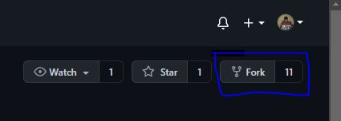
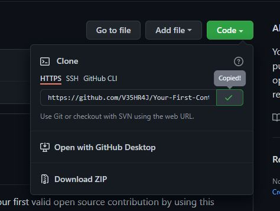

# Your-First-Contribution
You may learn how to make successful pull requests and get your first valid open source contribution by using this repository.

---

# ❓ What's Hacktoberfest 2021?

Hacktoberfest is the easiest way to get into open source! Hacktoberfest is a month long festival of open source code presented by [Digital Ocean](https://www.digitalocean.com/) and [DEV](https://www.dev.to/) this year in 2021.

During the entire month of October 2021, all you have to do is contribute to any open source projects and open at least 4 pull requests. Yes, any project and any kind of contributions. It can be a be a bug fix, improvement, or even a documentation change! And win a T-Shirt and awesome stickers.

If you’ve never contributed to open source before, this is the perfect time to get started because Hacktoberfest provides a large list of available contribution opportunities (and yes, there are always plenty for beginners too).

---

# 👕 Why Should I Contribute?

Hacktoberfest has a simple and plain moto.

> Support open source and earn a limited edition T-shirt!
So, yes! You can win a T-Shirt and few awesome stickers to attach on your laptop. On plus side, you will get into beautiful world of open source and get the international exposure.  
**Wait there's more!**

---
---
## Code Of Conduct
**Examples of behavior that contributes to creating a positive environment :**
- Using welcoming and inclusive language
- Gracefully accepting constructive criticism
- Focusing on what is best for the community
- Being respectful of differing viewpoints and experiences


**Examples of unacceptable behavior by participants include:**
- Trolling, insulting/derogatory comments, and personal or political attacks
- Public or private harassment
- Publishing others' private information, such as a physical or electronic address, without explicit permission
---


---
## Steps to setup this Repository Locally

  1. Fork this repository to your account.

  2. Go to Git Bash and Clone the forked repository using :
       a. Clone the repository
```bash
   git clone https://github.com/your_username/make-pull-request
```


 3. Open the folder in your favourite code editor and add your changes or modifications.

 4. Make your own branch and switch to it to make your changes.
 ```bash
  git checkout -b "<your-branch-name>"
 ```
## Creating a PR 
 
 1. After making changes or modification on to your code locally, you need to add these files to the staging area.
```bash
  git add <file-name>
```
 2. Once files added, you need to commit the changes to with an appropriate commit message.
```bash
  git commit -m "<your-message>"
```
 3. After commiting the changes, you need to push the changes
```bash
   git push origin "<your-branch-name>"
```
 4. Once you push the changes to your repository, the Compare & pull request button will appear in GitHub.

 5. Click it and you'll be taken to this screen

 6. Type a proper description and give the PR an appropriate title. Finally, Open a pull request by clicking the Create pull request button.

 7. That's it. You have opened a PR. Wait for it to get merged.

# :handshake: Our Contributors
<a href="https://github.com/V35HR4J/Your-First-Contribution/graphs/contributors">
  
</a>

# Recommended Repos 
- https://github.com/hctnm1/HacktoberFest-Python/
- https://github.com/hctnm1/HacktoberFest-2021/
- https://github.com/roshankcpkr/Hacktoberfest-web

## Thank You for your Amazing Contribution!!
